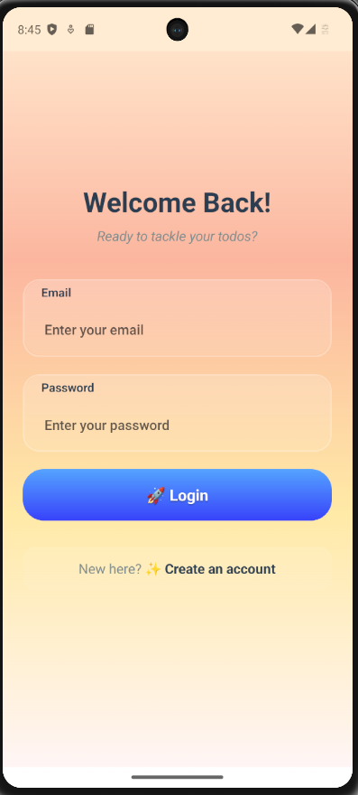
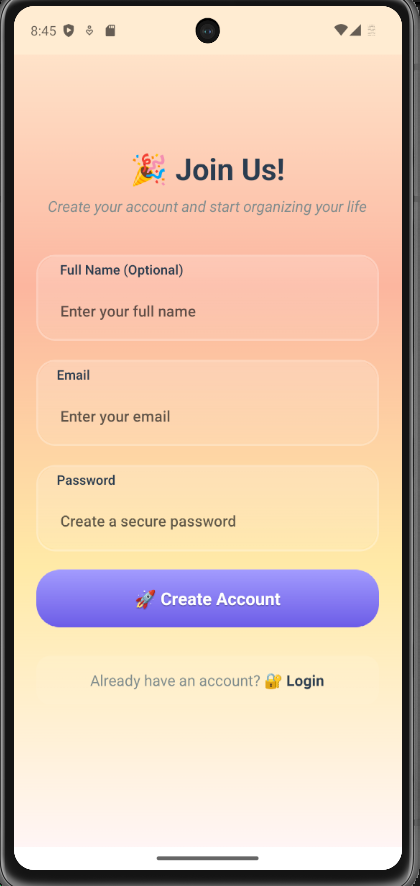
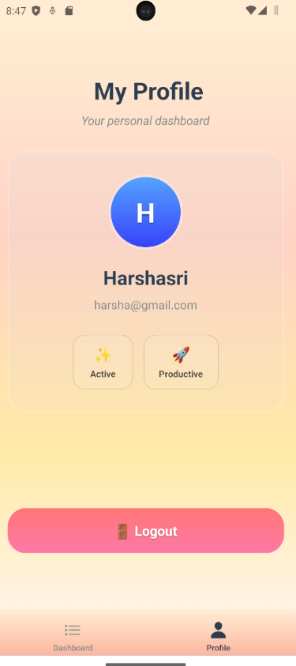
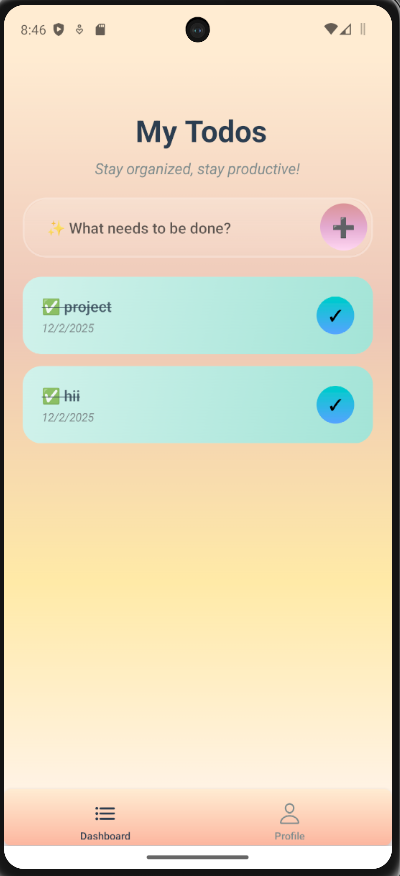
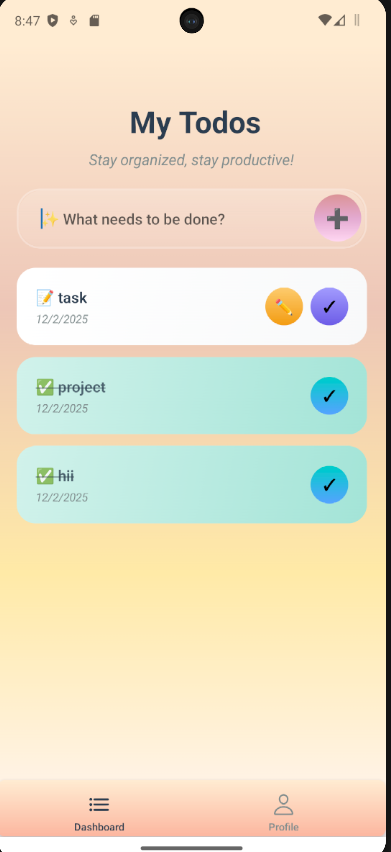
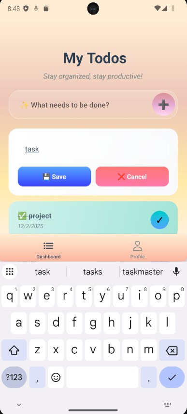

# 📱 Todo App – React Native (Expo)

A mobile todo app built in React Native that integrates with the FastAPI backend.

---

## 🔐 Features

- Login / Signup using FastAPI
- JWT stored in AsyncStorage
- Fetch, create and complete todos
- Logout functionality
- Navigation flow with protected screens
- Clean UI & error handling

---

## 🛠 Tech Stack

- React Native (Expo)
- React Navigation
- Axios
- AsyncStorage

---

## 📂 Project Structure

```
src/
  api/
    client.ts
  navigation/
    RootNavigator.tsx
  screens/
    LoginScreen.tsx
    SignupScreen.tsx
    DashboardScreen.tsx
```

---

## ▶️ Installation & Run App

Install dependencies:

```bash
npm install
```

Start development server:

```bash
npx expo start
```

Open in:

- Android Emulator
- iOS Simulator
- Expo Go app

---

## 🌐 Backend URL Setup

In `client.ts` update according to your device:

### Android Emulator:

```ts
http://10.0.2.2:8000
```

### Physical Device:

```ts
http://<your-ip>:8000
```

---

## 🧪 Testing Flow

1. Open the app
2. Signup or Login
3. Dashboard loads automatically
4. Create todos
5. Mark todos complete
6. Logout removes token

---

## 🖼️ Screenshots


```markdown
### Login Screen

```

---

```markdown
### Signup Screen

```

---

```markdown
### Profile Screen

```

---
```markdown
### Dashboard Screen


```

---
```markdown
### Edit Screen


```

---


